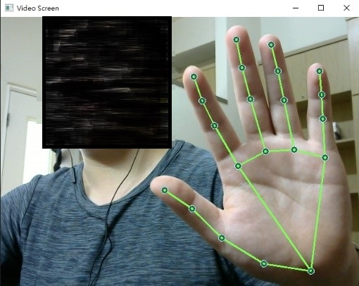
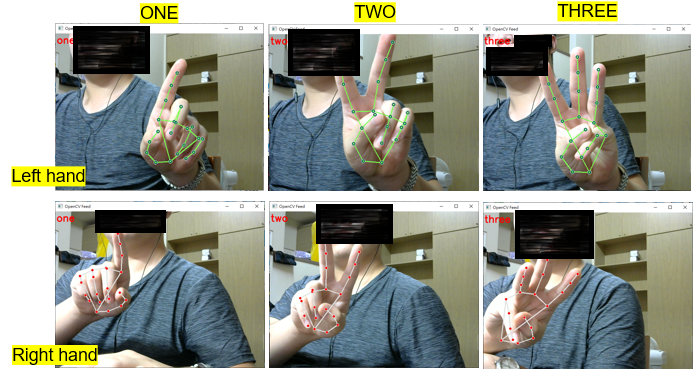

# ✋ Gesture Recognition with MediaPipe on Raspberry Pi

This project demonstrates a real-time **skeleton-based gesture recognition** system using **MediaPipe** and **TensorFlow**, with deployment targeted for **Raspberry Pi**.

We use **hand joint point detection** to extract 3D keypoints (x, y, z) from both hands, and train a neural network model to classify custom gestures.

---

##  Project Objectives

- Build a lightweight gesture recognition pipeline.
- Train on gesture keypoints extracted via MediaPipe.
- Deploy and run inference on low-resource devices like Raspberry Pi.

---

##  Dependencies

> Tested on: `Python 3.8.11`, `TensorFlow 2.3.0`

```bash
conda create -n gesture python=3.8.11
conda activate gesture

pip install tensorflow==2.3.0
pip install tensorflow-gpu==2.3.0  # Optional for CUDA support
pip install opencv-python
pip install mediapipe
pip install scikit-learn
pip install matplotlib
```

---

##  Project Structure

| File / Script             | Description |
|--------------------------|-------------|
| `draw_keypoints.py`      | Draws 2D keypoints and connects joints on images. |
| `get_keypoints.py`       | Extracts 21 hand joints per hand (x, y, z), handles zero-padding when missing. |
| `mediapipe_tool.py`      | Performs joint prediction using MediaPipe. |
| `keypointDemo.py`        | Demo: Shows if joint points are detected correctly (see image below). |
| `keypoint_label.py`      | For collecting custom gesture keypoint datasets. |
| `gesture.ipynb`          | Notebook for training gesture recognition model (e.g., on Google Colab). |
| `gesture_recognition.py` | Real-time gesture recognition with webcam or video input. |

---

##  Example: Keypoint Detection

```bash
python keypointDemo.py
```



---

##  Dataset Collection

Use this script to label and store custom gestures:

```bash
python keypoint_label.py
```

Each sample is saved with keypoints from both hands, padded if necessary.

---

##  Model Training

The neural network is trained using `gesture.ipynb`, where joint keypoint arrays are fed into a simple classifier.

You can run the notebook on Google Colab for GPU acceleration.

---

##  Real-Time Inference

Run gesture recognition in real time:

```bash
python gesture_recognition.py
```



---

##  Notes

- Make sure `MediaPipe` has access to your webcam or input image source.
- Joint detection accuracy may drop under poor lighting or occlusion.
- Extend the dataset with more gesture samples for better model generalization.

---

##  Acknowledgments

- [Google MediaPipe](https://github.com/google/mediapipe)
- TensorFlow team
